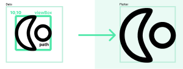

# path_icon

<p>
  <a href="https://pub.dartlang.org/packages/path_icon"></a>
  <a href="https://www.buymeacoffee.com/aloisdeniel">
    
  </a>
</p>

An icon widget based on a path.

## Quickstart

```dart
import 'package:path_icon/path_icon.dart';

final iconData = PathIconData.fromData(
      '''M101.06 190.322C92.8024 173.178 85.5 152.417 85.5 129.5C85.5 106.583 92.8024 85.822 101.06 68.6779C107.292 55.7406 114.872 43.3794 120.869 33.5992C122.641 30.7104 124.274 28.0468 125.694 25.6601C126.025 25.1026 126.345 24.562 126.652 24.0377C69.7024 25.5472 24 72.1864 24 129.5C24 186.814 69.7024 233.453 126.652 234.962C126.345 234.438 126.025 233.897 125.694 233.34C124.274 230.953 122.641 228.29 120.869 225.401C114.872 215.621 107.292 203.259 101.06 190.322ZM132.946 247.654C132.943 247.653 132.927 247.592 132.907 247.476C132.939 247.598 132.949 247.656 132.946 247.654ZM132.946 11.3456C132.949 11.3441 132.939 11.4017 132.907 11.5235C132.927 11.4081 132.943 11.3472 132.946 11.3456ZM140.886 212.119C127.146 189.698 109.5 160.905 109.5 129.5C109.5 98.0954 127.146 69.3018 140.886 46.8812C158.438 18.241 169.616 0 129.5 0C57.9791 0 0 57.9791 0 129.5C0 201.021 57.9791 259 129.5 259C169.616 259 158.438 240.759 140.886 212.119Z''');

@override
Widget build(BuildContext context) {
    return PathIcon(
        iconData,
        color: Colors.red,
        size: 48,
    );
}   
```

## Usage

### PathIconData

Path icon data represents the icon as a `Path` and a `viewBox` which specify a rectangle in user space which is mapped to the bounds of the viewport.



#### From a Path

To create data from a Flutter path, use the default constructor.

```dart
final iconData = PathIconData(
    path: Path()..addRect(Rect.fromLTWH(0,0,10,10)),
    viewBox: Rect.fromLTWH(0,0,0,0),
);
```

> If you want to automatically find the `viewBox`, you can use the `sanitized` constructor.

#### From data

To initialize the path with a data string as defined in SVG paths, use the `fromData` constructor.

```dart
final iconData = PathIconData.fromData(
    'M101.06 190.322C92.8024 173.178 85.5 152.417 85.5 129.5C85.5',
);
```

> If you don't give a `viewBox`, it is deduced from the path's bounds.

#### From SVG

To initialize the path with a data string as defined in SVG paths, use the `fromData` constructor.

```dart
final iconData = PathIconData.fromSvg(
    '''
<svg id='My icon' viewBox='0 0 200 200'>
    <path d='M101.06 190.322C92.8024 173.178 85.5 152.417 85.5 129.5C85.5' />
</svg>''',
);
```

### PathIcon

A graphical icon widget drawn from a path described in a `PathIconData`.

Icons are not animated. For an animated icon, consider `AnimatedPathIcon`.

```dart
@override
Widget build(BuildContext context) {
    return PathIcon(
        iconData,
        color: Colors.red,
        size: 48,
        semanticLabel: 'My icon',
    );
}   
```

### AnimatedPathIcon

Animated version of `PathIcon` that gradually changes its `color` and `size` over a period of time.

```dart
@override
Widget build(BuildContext context) {
    return AnimatedPathIcon(
        iconData,
        duration: const Duration(milliseconds: 500),
        curve: Curves.easeInOut,
        color: Colors.red,
        size: 48,
        semanticLabel: 'My icon',
    );
}   
```